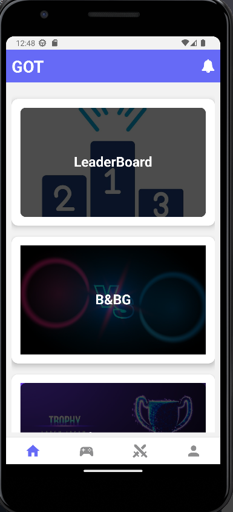

<a name="readme-top"></a>

<div align="center">

  <!--  -->
  <br/>

  <h3><b>GOT(Game Of Thought)</b></h3>
  <em>"Where everyone wants to be the GOAT(Greatest Of All Time)"</em>

</div>

<!-- TABLE OF CONTENTS -->

# 📗 Table of Contents

- [📗 Table of Contents](#-table-of-contents)
- [📖 \[GOT\] ](#-got-)
  - [🛠 Built With ](#-built-with-)
    - [Tech Stack ](#tech-stack-)
    - [Key Features ](#key-features-)
  - [🚀 Quick Preview ](#-quick-preview-)
  - [🚀 Live Demo ](#-live-demo-)
  - [💻 Getting Started ](#-getting-started-)
    - [Prerequisites](#prerequisites)
    - [Setup](#setup)
    - [Install](#install)
    - [Usage](#usage)
  - [👥 Authors ](#-authors-)
  - [🔭 Future Features ](#-future-features-)
  - [🤝 Contributing ](#-contributing-)
  - [⭐️ Show your support ](#️-show-your-support-)
  - [🙏 Acknowledgments ](#-acknowledgments-)
  - [📝 License ](#-license-)

<!-- PROJECT DESCRIPTION -->

# 📖 [GOT] <a name="about-project"></a>

> A mobile application that bring fun at parties, at school, on date and everywhere where people feel bored. People meet up to answer general knowledge questions or solving riddles and whoever scores high scores becomes the GOAT(Greatest Of All Time).
> A mobile application that bring fun at parties, at school, on date and everywhere where people feel bored. People meet up to answer general knowledge questions or solving riddles and whoever scores high scores becomes the GOAT(Greatest Of All Time).

## 🛠 Built With <a name="built-with"></a>

### Tech Stack <a name="tech-stack"></a>

<details>
  <summary>Client</summary>
  <ul>
    <li><a href="https://reactjs.org/">React.js</a></li>
    <li><a href="https://reactnative.dev/">React Native</a></li>
  </ul>
</details>

<details>
<summary>Backend & Database</summary>
  <ul>
    <li><a href="https://www.firebase.com/">Firebase</a></li>
  </ul>
</details>

<!-- Features -->

### Key Features <a name="key-features"></a>

- **Global Dashboard**
- **Battle & Become the GOAT**

<p align="right">(<a href="#readme-top">back to top</a>)</p>

<!-- Quick Preview -->

## 🚀 Quick Preview <a name="quick-preview"></a>

  

<p align="right">(<a href="#readme-top">back to top</a>)</p>

<!-- LIVE DEMO -->

## 🚀 Live Demo <a name="live-demo"></a>

- Not yet Deployed

<p align="right">(<a href="#readme-top">back to top</a>)</p>

<!-- GETTING STARTED -->

## 💻 Getting Started <a name="getting-started"></a>

### Prerequisites

In order to run this project you need:

```sh
 - NODEJS
```

### Setup

Clone this repository to your desired folder:

```sh
  cd your-folder
  git clone https://github.com/BertrandConxy/GOT-Game-Of-Thoughts.git
```

### Install

Install this project with:

```sh
  cd GOT-Game-Of-Thoughts
  npm install
```

### Usage

To run the project, execute the following command:

```sh
  npm start
```

<p align="right">(<a href="#readme-top">back to top</a>)</p>

<!-- AUTHORS -->

## 👥 Authors <a name="authors"></a>

👤 **Bertrand Mutangana Ishimwe**

- GitHub: [@BertrandConxy](https://github.com/BertrandConxy)
- Twitter: [@Bconxy](https://twitter.com/BertrandMutanga)
- LinkedIn: [Bertrand Mutangana Ishimwe](https://www.linkedin.com/in/bertrandmutangana)

<p align="right">(<a href="#readme-top">back to top</a>)</p>

<!-- FUTURE FEATURES -->

## 🔭 Future Features <a name="future-features"></a>

- **Attend GK Contests**
- **Participate in Surveys**

<p align="right">(<a href="#readme-top">back to top</a>)</p>

<!-- CONTRIBUTING -->

## 🤝 Contributing <a name="contributing"></a>

Contributions, issues, and feature requests are welcome!

Feel free to check the [issues page](https://github.com/BertrandConxy/GOT-Game-Of-Thoughts/issues).

<p align="right">(<a href="#readme-top">back to top</a>)</p>

<!-- SUPPORT -->

## ⭐️ Show your support <a name="support"></a>

If you like this project please don't hesitate to reach out to us because we need funding for the initial deployment and marketing.

<p align="right">(<a href="#readme-top">back to top</a>)</p>

<!-- ACKNOWLEDGEMENTS -->

## 🙏 Acknowledgments <a name="acknowledgements"></a>

We would like to thank everyone who helped us finalize this project idea and everyone who will be participating in its testing.

<p align="right">(<a href="#readme-top">back to top</a>)</p>

<!-- LICENSE -->

## 📝 License <a name="license"></a>

This project is [MIT](./LICENSE) licensed.

<p align="right">(<a href="#readme-top">back to top</a>)</p>
